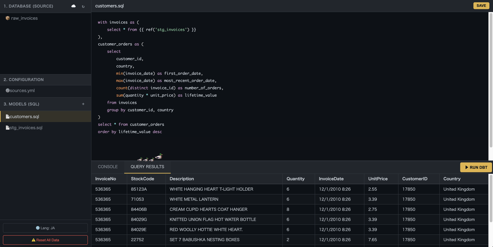

# 🦆 DuckBT


**DuckBT** is a lightweight, serverless SQL development environment designed for analytics engineers. It brings the power of **dbt (data build tool)** modeling syntax directly to your browser using **DuckDB-WASM**.

No python venv, no cloud warehouse credentials, no latency. Just you, your SQL, and a duck. 🦆

[**🚀 Try the Demo**](https://takimo.github.io/duckbt/)



## ✨ Features

* **Serverless & Local**: Powered by [DuckDB-WASM](https://duckdb.org/docs/api/wasm/overview). All data processing happens locally in your browser.
* **dbt-flavored SQL**: Supports Jinja templating like `{{ ref() }}` and `{{ source() }}`.
* **Instant Feedback**: Compile and run models instantly without round-trips to a cloud DW.
* **Data Persistence**: Saves your code and data load configuration to LocalStorage.
* **CSV Loading**: Load CSV data from external URLs (with CORS proxy support).
* **Cute Companion**: Includes a wandering duck and legendary quotes to keep you motivated.

## 🛠 Architecture

DuckBT is built with modern web technologies and a modular architecture:

* **Core Engine**: DuckDB-WASM (v1.29.0)
* **Compiler**: Mozilla Nunjucks (Jinja2-compatible templating)
* **Editor**: CodeJar + Prism.js (Syntax highlighting)
* **Config Parser**: js-yaml

### Project Structure

```text
duckbt/
├── src/
│   ├── main.js         # Entry point & UI logic
│   ├── db.js           # DuckDB-WASM wrapper
│   ├── editor.js       # Editor component
│   └── dbt-core.js     # Compiler & DAG logic (Pure functions)
├── tests/              # Unit tests (Vitest)
├── index.html          # Main application
├── style.css           # Styling
├── server.py           # Local dev server with COOP/COEP headers
└── coi-serviceworker.js # Cross-Origin Isolation handler
```

## 🚀 Getting Started
Since DuckDB-WASM requires Cross-Origin Isolation (COOP/COEP headers) to use high-performance features, you cannot simply open `index.html` file directly.

### Prerequisites

- Python 3.x (for local server)
- Node.js & npm (optional, for running tests)

### Running Locally

1. **Clone the repository**

```bash
git clone https://github.com/takimo/duckbt.git
cd duckbt
```

2. **Start the local server**  
   We provide a Python script that sets the necessary security headers.

```bash
python server.py
```

3. **Open in Browser**  
   Visit http://localhost:8000

## 🧪 Running Tests
Logic components (like the compiler and table name generators) are tested using Vitest.

```bash
# Install dependencies
npm install

# Run tests
npm test
```

## 📦 Deployment (GitHub Pages)
This project uses `coi-serviceworker.js` to enable Cross-Origin Isolation on GitHub Pages without server-side header configuration.

1. Push to GitHub.
2. Go to **Settings > Pages**.
3. Set **Source** to **GitHub Actions** or **Deploy from a branch** (main).
4. Your IDE is live! 🎉

## 🤝 Contributing
Contributions are welcome! Please feel free to submit a Pull Request.

1. Fork the Project
2. Create your Feature Branch (`git checkout -b feature/AmazingFeature`)
3. Commit your Changes (`git commit -m 'Add some AmazingFeature'`)
4. Push to the Branch (`git push origin feature/AmazingFeature`)
5. Open a Pull Request

## 📜 License
Distributed under the MIT License. See `LICENSE` for more information.

## 🙏 Acknowledgements

- [DuckDB](https://duckdb.org/) - For the amazing in-process SQL OLAP database.
- [dbt Labs](https://www.getdbt.com/) - For the inspiration on data modeling workflows.
- [Voluntas](https://github.com/voluntas) - For OPFS implementation references.

---

<p align="center">
Made with ❤️ and 🦆 by <a href="https://github.com/takimo">takimo</a>
</p>
